
# tarea1-peps

Pasos seguidos:

1. 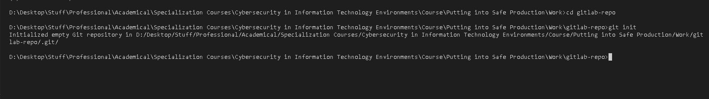 

Iniciamos el proyecto en local

2. 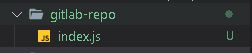 

Creamos algun archivo o modificación

3. 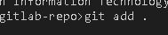 

Añadimos los archivos modificados

4. 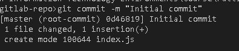 

Hacemos commit en local

5. 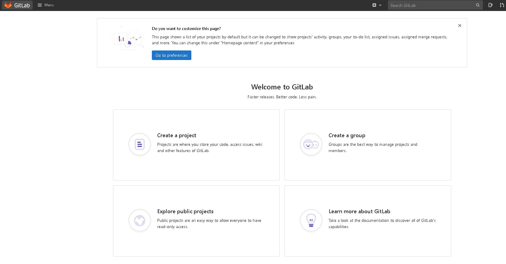 

Creamos repositorio remoto en GitLab dandole a "Create Project"

6. 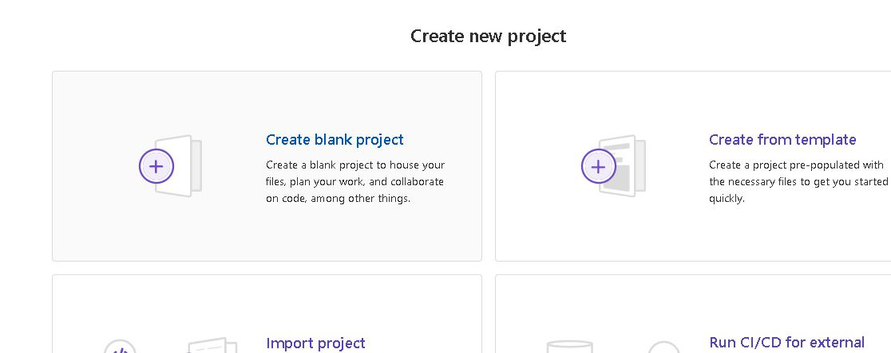 

Creamos repositorio en blanco"

7. 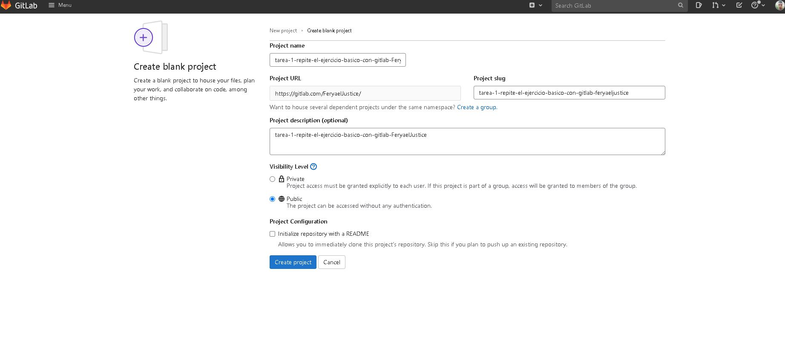 

Creamos el repositorio poniendole un nombre y sin crear el readme

8. 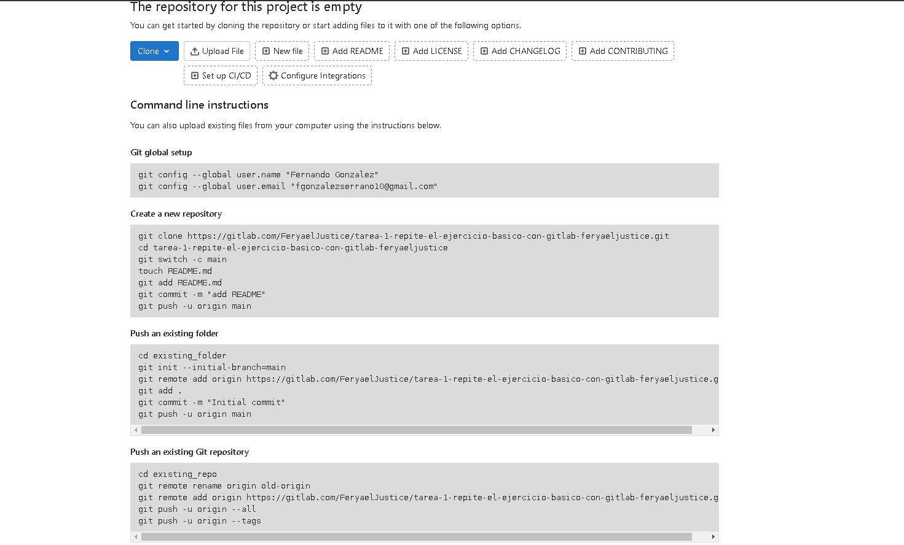 

Copiamos la url para añadir el proyecto a nuestro repositorio git local

9. 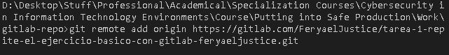 

Añadimos el repositorio remoto

10. 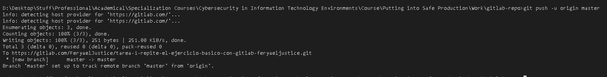 

Hacemos un git push (si es primera vez hacemos push en esa cuenta, nos pedira credenciales)

11.  

Generamos un personall access token

12. 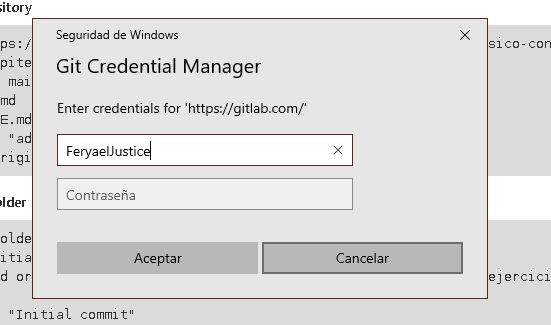 

Metemos las credenciales con el personal access token como password

13. 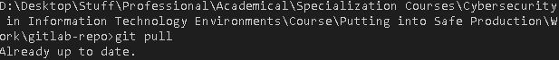 

Hacemos pull por si hay cambios traernoslos

14. 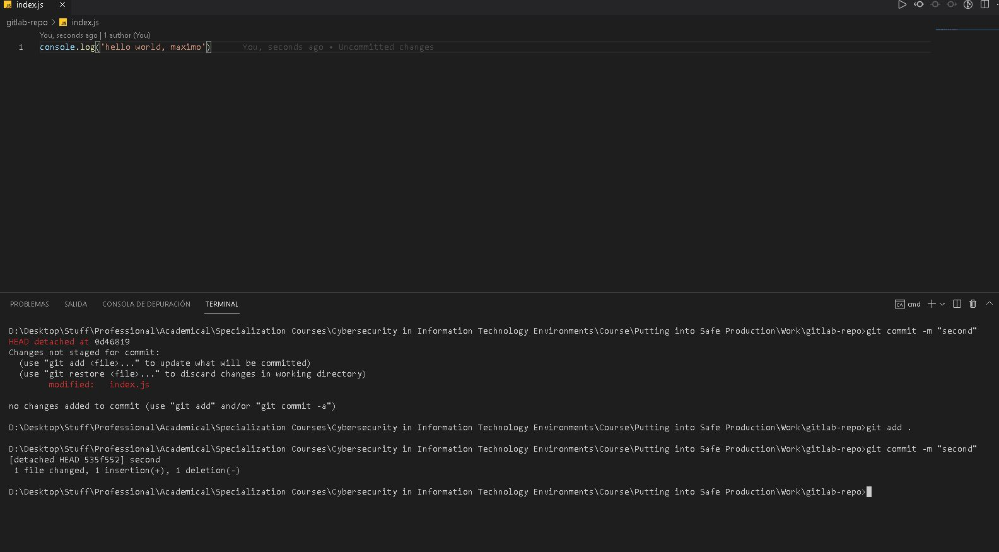 

Hacemos un cambio y hacemos commit

15. 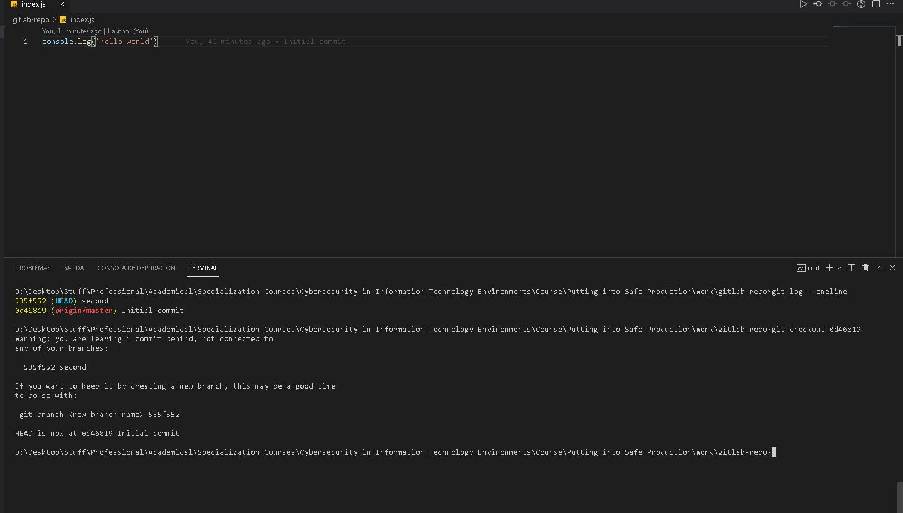 

Revertimos los cambios a otro commit cogiendo su hash identificador con el comando git log --oneline

16. 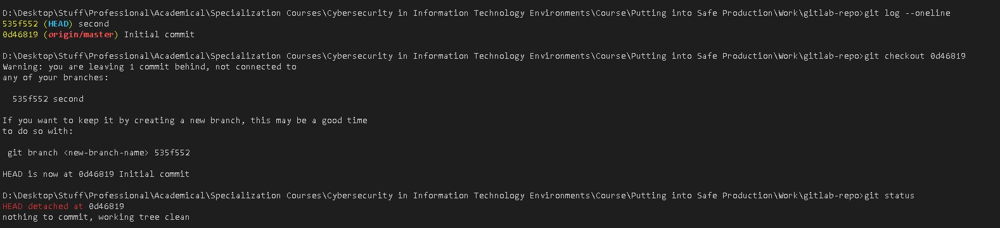 

Hacemos git status

Pasos en comandos:
git init
git remote add origin url_git
git add .
git commit -m "Initial commit"
git push -u origin master
