
# tarea1-peps

Pasos seguidos:

1. 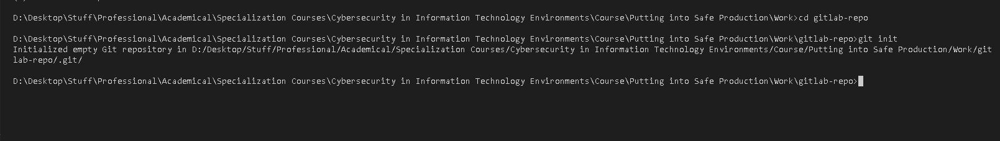 

Iniciamos el proyecto en local

2. 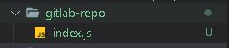 

Creamos algún archivo o hacemos alguna modificación.

3. 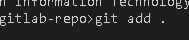 

Añadimos los archivos modificados

4. 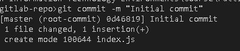 

Hacemos commit en local

5. 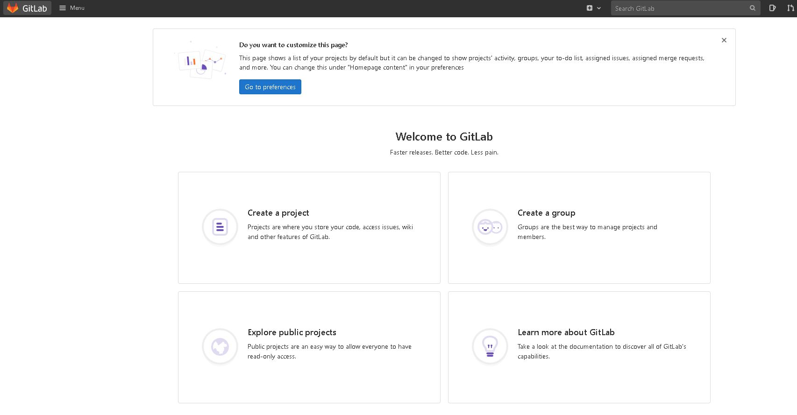 

Creamos un repositorio remoto en GitLab haciendo clic en "Create Project".

6. 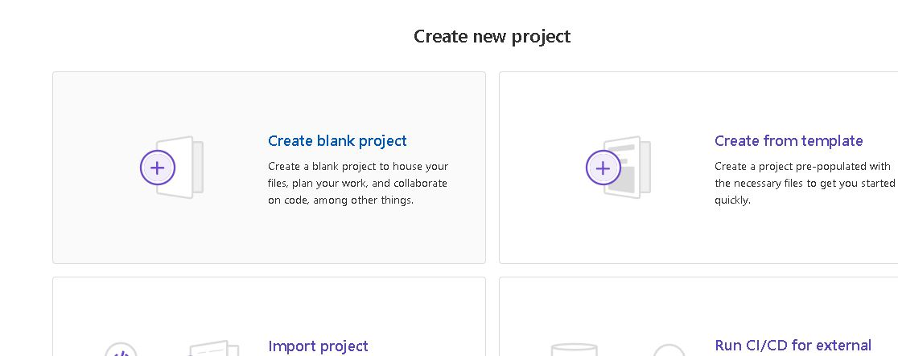 

Creamos un repositorio en blanco

7. 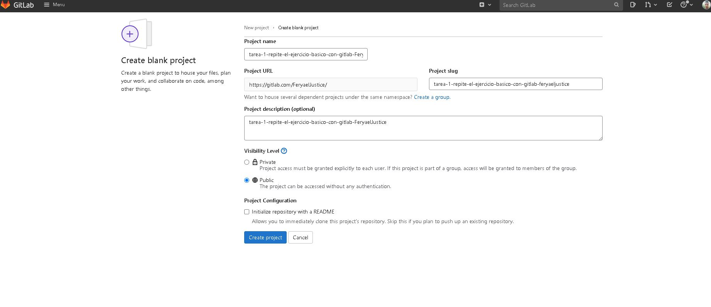 

Creamos el repositorio, le asignamos un nombre y no creamos el README.

8. 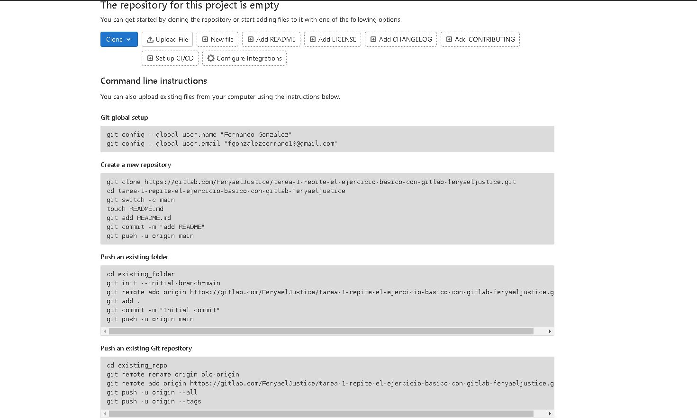 

Copiamos la URL para añadir el proyecto a nuestro repositorio Git local.

9. 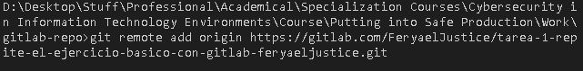 

Añadimos el repositorio remoto

10. 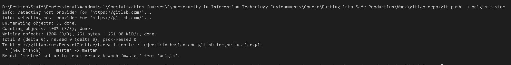 

Hacemos un git push (si es la primera vez que hacemos push en esa cuenta, nos pedirá las credenciales)

11. 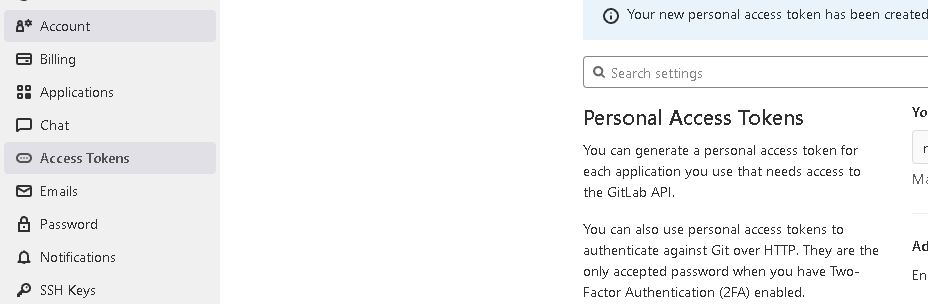 

Generamos un personal access token

12. 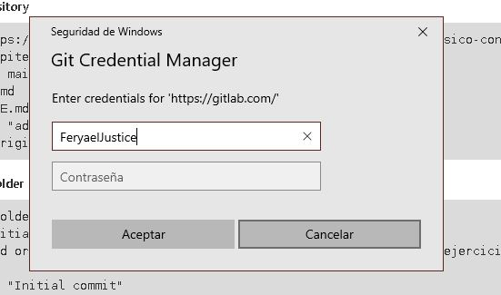 

Introducimos las credenciales y usamos el personal access token como contraseña

13. 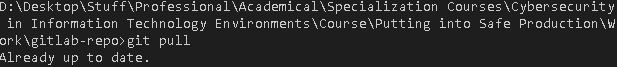 

Hacemos pull para incorporar los cambios que haya

14. 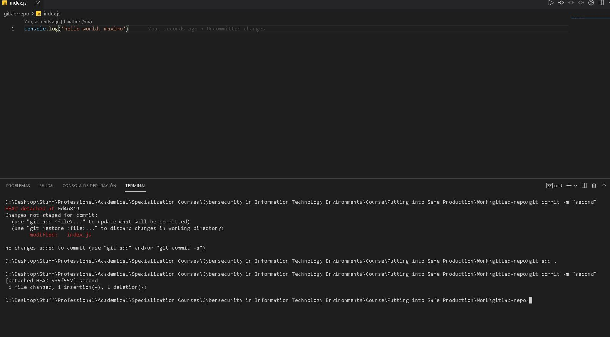 

Hacemos un cambio y hacemos commit

15. 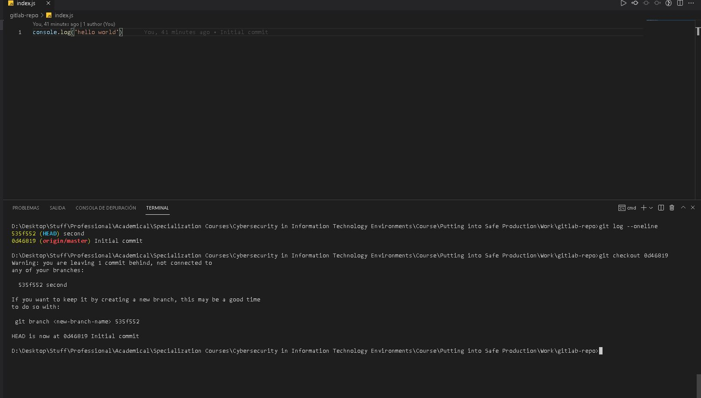 

Revertimos los cambios hasta otro commit usando su hash identificador, que obtenemos con el comando git log --oneline

16. 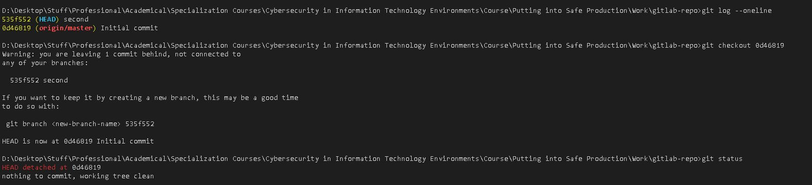 

Hacemos git status

Pasos en comandos:
git init
git remote add origin url_git
git add .
git commit -m "Initial commit"
git push -u origin master
