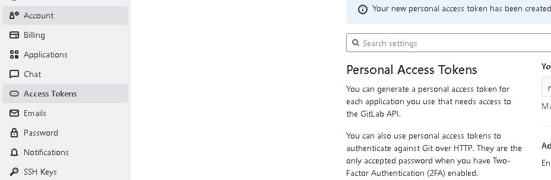

# tarea1-peps

Pasos seguidos:
1. 
2. 
3. 
4. 
5. 
6. 
7. 
8. 
9. 
10. 
11. 
12. 
13. 
14. 
15. 
16. 

Pasos en comandos:
git init
git remote add origin url_git
git add .
git commit -m "Initial commit"
git push -u origin master